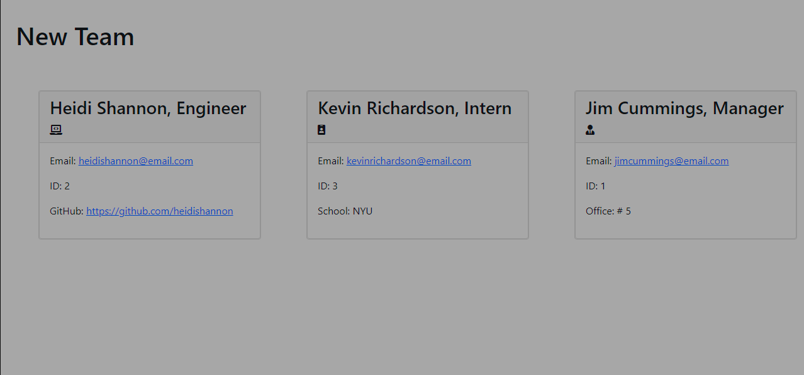

# TeamProfileGen

## Description

This is a command-line application that allows users to build and view a workforce of managers, engineers, and interns.

## Installation

Type the following into your terminal or command line to copy this repository: `git clone git@github.com:twohunters/TeamProfileGen.git`

## Usage

## Credits

[Jason Anderson](https://github.com/twohunters)

## Technology

[Node.js](https://nodejs.org/en/)

[Jest](https://www.npmjs.com/package/jest)

[Inquirer](https://www.npmjs.com/package/inquirer)